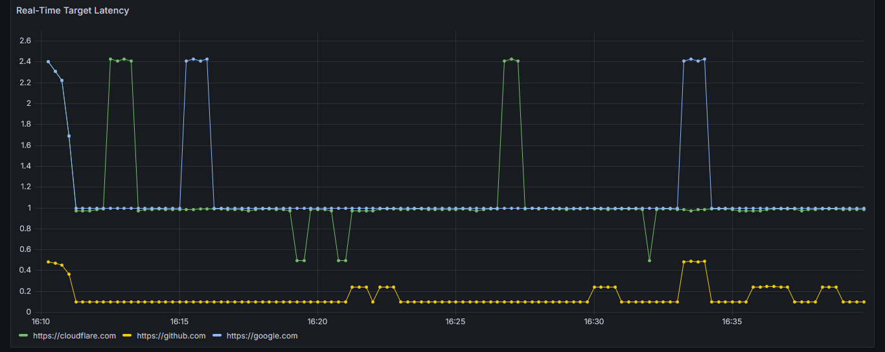
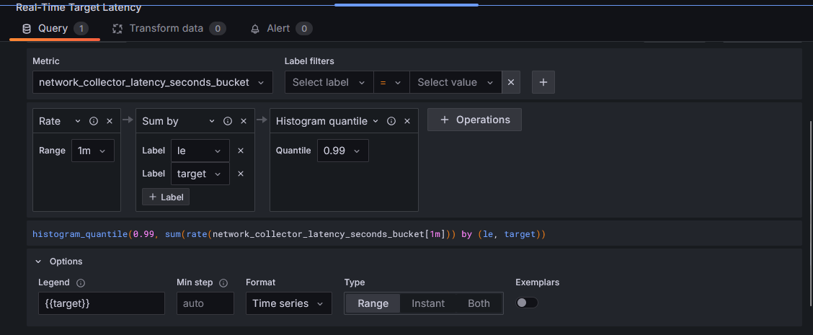

# network-metric-collector

A lightweight, production-grade network monitoring agent written in Go. It periodically probes a configurable list of HTTP targets, measures their availability and latency, and exposes the results as Prometheus metrics — ready to be visualized in Grafana with zero extra configuration.

---

## Live demo

Real-time latency tracking across multiple targets, rendered directly in Grafana:



Powered by a P99 Histogram query built natively in the Grafana query editor:



---

## How it works

On startup, the collector reads a list of target URLs and a polling interval from a YAML config file. At every tick it spawns concurrent goroutines (one per target), sends an HTTP GET request, and records two metrics:

- **Request count** — labeled by target URL and HTTP status code
- **Latency distribution** — a Histogram that lets you compute P50, P95, and P99 percentiles

All metrics are exposed at `:2112/metrics` in the Prometheus scrape format. The bundled Docker Compose stack wires up Prometheus and Grafana automatically.

```
┌─────────────────────────────────────────────────────────┐
│                     Docker Compose                       │
│                                                         │
│  ┌──────────────┐     scrape      ┌──────────────────┐  │
│  │   collector  │ ──────────────► │   prometheus     │  │
│  │  :2112/metrics│                │      :9090       │  │
│  └──────────────┘                 └────────┬─────────┘  │
│                                            │ datasource │
│                                   ┌────────▼─────────┐  │
│                                   │     grafana      │  │
│                                   │      :3000       │  │
│                                   └──────────────────┘  │
└─────────────────────────────────────────────────────────┘
```

---

## Stack

| Layer | Technology |
|---|---|
| Language | Go 1.23 |
| Metrics | Prometheus `client_golang` |
| Logging | `log/slog` (JSON structured) |
| Config | YAML via `gopkg.in/yaml.v3` |
| Visualization | Grafana OSS 10.4 |
| Time-series DB | Prometheus 2.51 |
| Containerization | Docker + Docker Compose |

---

## Getting started

### Prerequisites

- [Docker](https://docs.docker.com/get-docker/) and [Docker Compose](https://docs.docker.com/compose/install/) installed

### Run the full stack

```bash
docker compose up --build
```

This starts three containers:

| Service | URL | Description |
|---|---|---|
| collector | `http://localhost:2112/metrics` | Raw Prometheus metrics |
| Prometheus | `http://localhost:9090` | Query and explore time-series data |
| Grafana | `http://localhost:3000` | Dashboard visualization |

Grafana default credentials: **admin / admin**

---

## Configuration

Edit `configs/settings.yaml` to set your targets and polling interval:

```yaml
settings:
  interval: 10        # Polling interval in seconds
  targets:
    - "https://google.com"
    - "https://github.com"
    - "https://your-api.com/healthz"
```

Restart the collector after any config change:

```bash
docker compose restart collector
```

---

## Metrics reference

| Metric | Type | Labels | Description |
|---|---|---|---|
| `network_collector_requests_total` | Counter | `target`, `status` | Total probes executed, labeled by HTTP status code or `error` |
| `network_collector_latency_seconds` | Histogram | `target` | Full latency distribution in seconds (P50, P95, P99 available) |

### Example Prometheus queries

```promql
# P99 latency per target (used in the dashboard above)
histogram_quantile(0.99, sum(rate(network_collector_latency_seconds_bucket[1m])) by (le, target))

# Availability rate per target (last 5 minutes)
rate(network_collector_requests_total{status="200"}[5m])

# P95 latency per target
histogram_quantile(0.95, sum(rate(network_collector_latency_seconds_bucket[5m])) by (le, target))

# Error rate
rate(network_collector_requests_total{status="error"}[5m])
```

---

## Project structure

```
network-metric-collector/
├── cmd/
│   └── collector/
│       └── main.go          # Entry point: config, lifecycle, signal handling
├── internal/
│   ├── config/
│   │   └── config.go        # YAML config loader
│   └── monitor/
│       ├── scheduler.go     # HTTP probing and Prometheus metric recording
│       └── scheduler_test.go# Unit tests using httptest mock server
├── configs/
│   ├── settings.yaml        # Target list and polling interval
│   └── prometheus.yml       # Prometheus scrape configuration
├── docs/
│   ├── grafana-dashboard.png
│   └── grafana-query.png
├── Dockerfile               # Multi-stage build → scratch final image
├── docker-compose.yaml      # Collector + Prometheus + Grafana stack
├── go.mod
└── go.sum
```

---

## Running tests

```bash
go test ./...
```

The test suite uses `net/http/httptest` to spin up isolated mock HTTP servers — no real network calls, no external dependencies.

---

## Design decisions

- **Shared HTTP client** — a single `http.Client` is created at startup and passed down to all probes, enabling TCP connection reuse via Keep-Alive.
- **Body draining** — `io.Copy(io.Discard, resp.Body)` is called before closing to return connections to the pool instead of destroying them.
- **Histogram over Gauge** — latency is recorded as a `HistogramVec` instead of a `GaugeVec` so percentile queries (P50, P95, P99) are available natively in Prometheus.
- **Graceful shutdown** — OS signals cancel a `context.Context` propagated to all in-flight HTTP requests. The Prometheus metrics server is also shut down cleanly with a 5-second timeout before the process exits.
- **Scratch Docker image** — the final image contains only the statically linked binary and TLS certificates, with no OS layer or shell.
